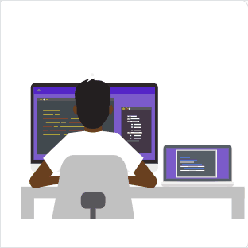

# Exercício HTML + CSS Avançado + Jacascript Intermediário - Lista de Slides com avançar e voltar JavaScript

Exercício de HTML e CSS avançado e JavaScript Intermediário para praticar o que aprendi na extensão universitária Dev Full Stack DevEmDobro até o presente momento.

## Recursos

Este projeto demonstra as hailidades adquiridas, englobando HTML, CSS, FlexBox, e o principal atributo, JavaScript para avançar e voltar as imagens.
A preocupação foi usar de maneira correta a estilização, com imagens trazidas do Figma, ('https://www.figma.com/design/zBKnYG9UNdUiIr8ClQTWSG/DESAFIO---HTML%2FCSS%2FJS-INTERMEDI%C3%81RIO?node-id=0-1&p=f&t=N8tj1nil2k3ePZLn-0') concentrando a maior parte do esforço no código JavaScript para que houvesse o ir e voltar de maneira correta das imagens dentro da apresentação do sllde.

## Tecnologias utilizadas

- HTML;
- CSS,
- JavaScript.

## Inicialização

Não há necessidade de nennhum npm ao fazer o git.clone.

## Colaboradores

- Exercício de HTML CSS avançado na extensão universitária Full Stack Developer DevEmDobro https://www.instagram.com/devemdobro/;
- Levando a sério para me tornar cada dia melhor.  
 https://github.com/IsaiasLourenco 
 https://www.linkedin.com/in/isaias-louren%C3%A7o/

